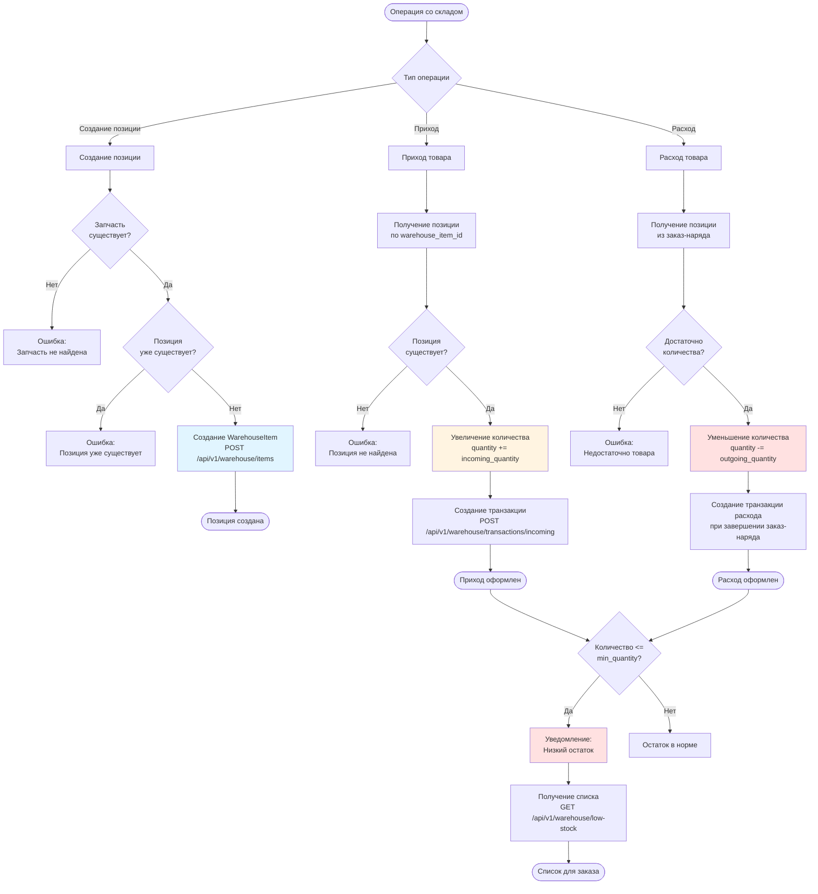
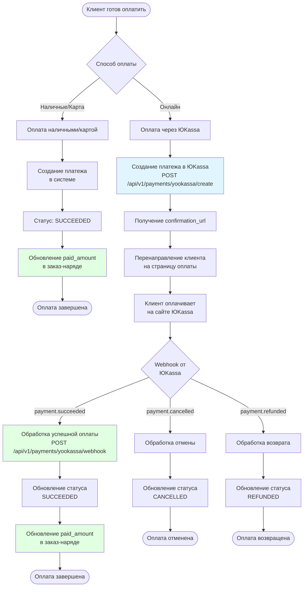

# Бизнес-процессы - Система управления автосервисом

## Содержание

1. [Жизненный цикл заказ-наряда](#жизненный-цикл-заказ-наряда)
2. [Процесс расчета зарплаты](#процесс-расчета-зарплаты)
3. [Складские операции](#складские-операции)
4. [Процесс оплаты заказ-наряда](#процесс-оплаты-заказ-наряда)
5. [Интеграции с внешними системами](#интеграции-с-внешними-системами)

---

## Жизненный цикл заказ-наряда

### Общее описание
Заказ-наряд является центральной сущностью системы. Он связывает клиента (через транспортное средство), работы, запчасти, сотрудников и финансовые операции.

### Диаграмма процесса

```mermaid
flowchart TD
    Start([Клиент обращается в автосервис]) --> CreateVehicle{Транспортное средство<br/>существует?}
    CreateVehicle -->|Нет| CreateV[Создание транспортного<br/>средства]
    CreateVehicle -->|Да| SelectV[Выбор транспортного<br/>средства]
    CreateV --> CreateOrder[Создание заказ-наряда<br/>POST /api/v1/orders/]
    SelectV --> CreateOrder
    
    CreateOrder --> AddWorks[Добавление работ<br/>order_works]
    AddWorks --> AddParts[Добавление запчастей<br/>order_parts]
    AddParts --> CalcTotal[Автоматический расчет<br/>общей суммы]
    CalcTotal --> AssignMechanic{Назначить<br/>механика?}
    
    AssignMechanic -->|Да| SetMechanic[Установка mechanic_id<br/>PUT /api/v1/orders/{id}]
    AssignMechanic -->|Нет| StatusNew[Статус: NEW]
    SetMechanic --> StatusInProgress[Статус: IN_PROGRESS]
    StatusNew --> WaitAssignment[Ожидание назначения]
    WaitAssignment --> SetMechanic
    
    StatusInProgress --> WorkInProgress[Механик выполняет работу]
    WorkInProgress --> UpdateOrder{Нужно обновить<br/>работы/запчасти?}
    UpdateOrder -->|Да| Update[Обновление заказ-наряда<br/>PUT /api/v1/orders/{id}]
    Update --> RecalcTotal[Пересчет суммы]
    RecalcTotal --> WorkInProgress
    UpdateOrder -->|Нет| CompleteWork{Работа<br/>завершена?}
    
    CompleteWork -->|Нет| WorkInProgress
    CompleteWork -->|Да| CompleteOrder[Завершение заказ-наряда<br/>POST /api/v1/orders/{id}/complete]
    
    CompleteOrder --> CheckStock{Проверка наличия<br/>запчастей на складе}
    CheckStock -->|Недостаточно| ErrorStock[Ошибка:<br/>Недостаточно запчастей]
    ErrorStock --> UpdateOrder
    CheckStock -->|Достаточно| WriteOff[Списание запчастей<br/>со склада]
    
    WriteOff --> CreateTransactions[Создание транзакций<br/>расхода]
    CreateTransactions --> UpdateStatus[Статус: COMPLETED]
    UpdateStatus --> Payment[Процесс оплаты]
    Payment --> End([Заказ-наряд закрыт])
    
    CreateOrder -.->|Отмена| Cancel[Отмена заказ-наряда<br/>POST /api/v1/orders/{id}/cancel]
    StatusInProgress -.->|Отмена| Cancel
    Cancel --> StatusCancelled[Статус: CANCELLED]
    StatusCancelled --> EndCancel([Заказ-наряд отменен])
    
    style CreateOrder fill:#e1f5ff
    style CompleteOrder fill:#fff4e1
    style WriteOff fill:#ffe1e1
    style Payment fill:#e1ffe1
    style End fill:#e1ffe1
```

### Детальное описание этапов

#### 1. Создание заказ-наряда

**Endpoint:** `POST /api/v1/orders/`

**Участники:**
- Менеджер (MANAGER или ADMIN)

**Входные данные:**
- `vehicle_id` - ID транспортного средства
- `mechanic_id` (опционально) - ID механика
- `order_works[]` - Список работ с количеством и ценой
- `order_parts[]` - Список запчастей с количеством и ценой

**Процесс:**
1. Система генерирует уникальный номер заказ-наряда в формате `ORD-YYYYMMDD-NNNN`
2. Автоматически устанавливается `employee_id` из текущего пользователя
3. Рассчитывается общая сумма: сумма работ + сумма запчастей
4. Создаются записи `OrderWork` и `OrderPart`
5. Статус устанавливается в `NEW`

**Выходные данные:**
- Созданный заказ-наряд с номером и рассчитанной суммой

**Особенности:**
- Если `mechanic_id` указан, статус можно сразу установить в `IN_PROGRESS`
- Если не указан, заказ-наряд остается в статусе `NEW` до назначения механика

---

#### 2. Назначение механика

**Endpoint:** `PUT /api/v1/orders/{order_id}`

**Участники:**
- Менеджер (MANAGER или ADMIN)

**Процесс:**
1. Устанавливается `mechanic_id`
2. Статус меняется на `IN_PROGRESS`

**Особенности:**
- Механик может быть назначен при создании или позже
- Можно переназначить механика в процессе работы

---

#### 3. Выполнение работ

**Участники:**
- Механик (MECHANIC)

**Процесс:**
1. Механик видит назначенные ему заказ-наряды через `GET /api/v1/orders/`
2. Просматривает детали заказ-наряда через `GET /api/v1/orders/{order_id}`
3. Выполняет работы согласно списку `order_works`
4. Использует запчасти согласно списку `order_parts`

**Особенности:**
- Механик видит только свои заказ-наряды (где он назначен механиком)
- Может обновить заказ-наряд (добавить/изменить работы/запчасти) через менеджера

---

#### 4. Обновление заказ-наряда

**Endpoint:** `PUT /api/v1/orders/{order_id}`

**Участники:**
- Менеджер (MANAGER или ADMIN)

**Процесс:**
1. Можно изменить список работ (`order_works`)
2. Можно изменить список запчастей (`order_parts`)
3. При изменении автоматически пересчитывается общая сумма
4. Старые записи `OrderWork` и `OrderPart` удаляются, создаются новые

**Особенности:**
- Обновление работ и запчастей заменяет все существующие (не добавляет)
- Можно изменить статус заказ-наряда
- Можно переназначить механика

---

#### 5. Завершение заказ-наряда

**Endpoint:** `POST /api/v1/orders/{order_id}/complete`

**Участники:**
- Любой авторизованный пользователь (обычно механик или менеджер)

**Процесс:**
1. Проверка статуса (не должен быть `COMPLETED`)
2. Для каждой запчасти в `order_parts`:
   - Поиск позиции на складе по `part_id`
   - Проверка достаточности количества
   - Уменьшение количества на складе
   - Создание транзакции расхода (`WarehouseTransaction`)
3. Установка статуса `COMPLETED`
4. Установка `completed_at` на текущее время

**Валидация:**
- Если запчасть отсутствует на складе → ошибка
- Если недостаточно количества → ошибка
- Если заказ-наряд уже завершен → ошибка

**Особенности:**
- Процесс атомарный (все или ничего)
- При ошибке транзакция откатывается
- Транзакции расхода связаны с заказ-нарядом и сотрудником

---

#### 6. Отмена заказ-наряда

**Endpoint:** `POST /api/v1/orders/{order_id}/cancel`

**Участники:**
- Менеджер (MANAGER или ADMIN)

**Процесс:**
1. Установка статуса `CANCELLED`
2. Заказ-наряд больше не может быть изменен или завершен

**Особенности:**
- Можно отменить только заказ-наряды в статусах `NEW` или `IN_PROGRESS`
- Завершенные заказ-наряды нельзя отменить

---

## Процесс расчета зарплаты

### Общее описание
Система автоматически рассчитывает зарплату сотрудников на основе базовой зарплаты и выполненных заказ-нарядов за период.

### Диаграмма процесса

```mermaid
flowchart TD
    Start([Начало расчетного периода]) --> SelectEmployee[Выбор сотрудника]
    SelectEmployee --> CheckPeriod{Проверка:<br/>Расчет за период<br/>уже существует?}
    
    CheckPeriod -->|Да| ErrorExists[Ошибка:<br/>Расчет уже существует]
    ErrorExists --> EndError([Ошибка])
    
    CheckPeriod -->|Нет| GetBaseSalary[Получение базовой<br/>зарплаты сотрудника]
    GetBaseSalary --> GetOrders[Поиск завершенных<br/>заказ-нарядов за период]
    
    GetOrders --> FilterOrders[Фильтрация:<br/>- mechanic_id = employee_id<br/>- status = COMPLETED<br/>- completed_at в периоде]
    FilterOrders --> CountOrders[Подсчет количества<br/>заказ-нарядов]
    
    CountOrders --> CalcBonus[Расчет бонуса:<br/>базовая_зарплата * 0.05 * количество_заказов]
    CalcBonus --> CalcPenalty[Расчет штрафов<br/>пока = 0]
    CalcPenalty --> CalcTotal[Расчет итоговой суммы:<br/>базовая + бонус - штраф]
    
    CalcTotal --> CreateSalary[Создание записи Salary<br/>POST /api/v1/salary/calculate]
    CreateSalary --> SetStatus[Статус: CALCULATED]
    SetStatus --> Review[Проверка бухгалтером]
    
    Review --> Approve{Утвердить?}
    Approve -->|Нет| Adjust[Корректировка<br/>бонусов/штрафов]
    Adjust --> Review
    Approve -->|Да| MarkPaid[Отметка о выплате<br/>POST /api/v1/salary/{id}/pay]
    
    MarkPaid --> SetPaidStatus[Статус: PAID]
    SetPaidStatus --> SetPaidAt[Установка paid_at]
    SetPaidAt --> End([Зарплата выплачена])
    
    style CreateSalary fill:#e1f5ff
    style CalcBonus fill:#fff4e1
    style MarkPaid fill:#e1ffe1
    style End fill:#e1ffe1
```

### Детальное описание этапов

#### 1. Инициация расчета

**Endpoint:** `POST /api/v1/salary/calculate`

**Участники:**
- Бухгалтер (ACCOUNTANT или ADMIN)

**Входные данные:**
- `employee_id` - ID сотрудника
- `period_start` - Начало периода (дата)
- `period_end` - Конец периода (дата)

**Валидация:**
- Проверка существования сотрудника
- Проверка, что расчет за этот период еще не существует

---

#### 2. Расчет базовой зарплаты

**Процесс:**
1. Получение `salary_base` из записи `Employee`
2. Базовая зарплата берется как есть (не пересчитывается)

---

#### 3. Подсчет выполненных заказ-нарядов

**Процесс:**
1. Поиск заказ-нарядов с условиями:
   - `mechanic_id` = `employee_id` (сотрудник был механиком)
   - `status` = `COMPLETED` (заказ-наряд завершен)
   - `completed_at` >= `period_start`
   - `completed_at` <= `period_end`
2. Подсчет количества таких заказ-нарядов

**Формула бонуса:**
```
bonus = base_salary * 0.05 * completed_orders_count
```

**Пример:**
- Базовая зарплата: 60,000 руб.
- Выполнено заказов: 10
- Бонус: 60,000 * 0.05 * 10 = 30,000 руб.

---

#### 4. Расчет итоговой суммы

**Формула:**
```
total = base_salary + bonus - penalty
```

**Текущая реализация:**
- `penalty` всегда = 0 (не реализовано)

---

#### 5. Создание записи зарплаты

**Процесс:**
1. Создание записи `Salary` с рассчитанными значениями
2. Статус устанавливается в `CALCULATED`
3. `paid_at` = NULL

---

#### 6. Выплата зарплаты

**Endpoint:** `POST /api/v1/salary/{salary_id}/pay`

**Участники:**
- Бухгалтер (ACCOUNTANT или ADMIN)

**Процесс:**
1. Установка статуса `PAID`
2. Установка `paid_at` на текущее время

**Особенности:**
- Операция необратима (нет механизма отмены выплаты)
- Можно отметить выплату только для расчетов со статусом `CALCULATED`

---

## Складские операции

### Общее описание
Система управления складом отслеживает остатки запчастей, приход и расход товаров, а также уведомляет о низких остатках.

### Диаграмма процесса



### Детальное описание операций

#### 1. Создание позиции на складе

**Endpoint:** `POST /api/v1/warehouse/items`

**Участники:**
- Менеджер (MANAGER или ADMIN)

**Входные данные:**
- `part_id` - ID запчасти (уникальная связь)
- `quantity` - Начальное количество
- `min_quantity` - Минимальный остаток для уведомлений
- `location` (опционально) - Местоположение на складе

**Процесс:**
1. Проверка существования запчасти
2. Проверка, что позиция для этой запчасти еще не создана
3. Создание записи `WarehouseItem`

**Особенности:**
- Одна запчасть = одна позиция на складе (уникальная связь)
- Позиция создается один раз, затем только обновляется через транзакции

---

#### 2. Приход товара

**Endpoint:** `POST /api/v1/warehouse/transactions/incoming`

**Участники:**
- Менеджер (MANAGER или ADMIN)

**Входные данные:**
- `warehouse_item_id` - ID позиции склада
- `transaction_type` - Должен быть `incoming`
- `quantity` - Количество для прихода
- `price` (опционально) - Цена за единицу
- `order_id` (опционально) - ID заказа поставщика

**Процесс:**
1. Получение позиции склада
2. Увеличение `quantity` на значение `incoming_quantity`
3. Создание записи `WarehouseTransaction` с типом `INCOMING`
4. Автоматическое установление `employee_id` из текущего пользователя

**Особенности:**
- Транзакция прихода может быть связана с заказом поставщика
- Цена сохраняется для учета стоимости товара

---

#### 3. Расход товара

**Процесс:**
Автоматически выполняется при завершении заказ-наряда (`POST /api/v1/orders/{id}/complete`)

**Участники:**
- Система (автоматически)

**Процесс:**
1. Для каждой запчасти в `order_parts`:
   - Поиск позиции склада по `part_id`
   - Проверка достаточности количества
   - Уменьшение `quantity` на значение `order_part.quantity`
   - Создание транзакции расхода с типом `OUTGOING`
   - Связь транзакции с заказ-нарядом и сотрудником

**Валидация:**
- Если запчасть отсутствует на складе → ошибка
- Если `quantity < order_part.quantity` → ошибка

**Особенности:**
- Процесс атомарный (все запчасти или ничего)
- Транзакции расхода всегда связаны с заказ-нарядом

---

#### 4. Уведомление о низком остатке

**Endpoint:** `GET /api/v1/warehouse/low-stock`

**Участники:**
- Любой авторизованный пользователь

**Процесс:**
1. Поиск всех позиций, где `quantity <= min_quantity`
2. Возврат списка таких позиций с информацией о запчасти

**Использование:**
- Для формирования заказа поставщику
- Для контроля остатков
- Для планирования закупок

---

## Процесс оплаты заказ-наряда

### Общее описание
Система поддерживает несколько способов оплаты: наличные, карта и онлайн-платежи через ЮKassa.

### Диаграмма процесса



### Детальное описание этапов

#### 1. Создание платежа через ЮKassa

**Endpoint:** `POST /api/v1/payments/yookassa/create`

**Участники:**
- Менеджер (MANAGER или ADMIN)

**Входные данные:**
- `order_id` - ID заказ-наряда
- `amount` - Сумма платежа
- `return_url` (опционально) - URL для возврата после оплаты

**Процесс:**
1. Создание платежа в системе ЮKassa через API
2. Сохранение `yookassa_payment_id` в системе
3. Создание записи `Payment` со статусом `PENDING`
4. Возврат `confirmation_url` для перенаправления клиента

**Особенности:**
- Платеж создается асинхронно
- Клиент перенаправляется на страницу оплаты ЮKassa
- Статус платежа обновляется через webhook

---

#### 2. Обработка webhook от ЮKassa

**Endpoint:** `POST /api/v1/payments/yookassa/webhook`

**Участники:**
- Система ЮKassa (автоматически)

**Процесс:**
1. Получение уведомления от ЮKassa
2. Проверка подписи (должна быть реализована)
3. Обновление статуса платежа в системе:
   - `payment.succeeded` → статус `SUCCEEDED`
   - `payment.cancelled` → статус `CANCELLED`
   - `payment.refunded` → статус `REFUNDED`
4. При успешной оплате:
   - Обновление `paid_amount` в заказ-наряде
   - `paid_amount += payment.amount`

**Особенности:**
- Webhook должен быть защищен проверкой подписи
- Поддерживается частичная оплата (несколько платежей на один заказ-наряд)

---

#### 3. Частичная оплата

**Процесс:**
- Один заказ-наряд может иметь несколько платежей
- `paid_amount` в заказ-наряде = сумма всех успешных платежей
- Можно отслеживать остаток к оплате: `total_amount - paid_amount`

---

## Интеграции с внешними системами

### 1. Интеграция с ГИБДД

**Endpoint:** `GET /api/v1/integrations/gibdd/vehicle/{vin}`

**Назначение:**
- Проверка транспортного средства по VIN номеру
- Получение информации о регистрации, истории ДТП и т.д.

**Участники:**
- Менеджер (MANAGER или ADMIN)

**Процесс:**
1. Отправка запроса в API ГИБДД с VIN номером
2. Получение и обработка ответа
3. Возврат данных клиенту

**Примечание:**
- Конкретная реализация зависит от доступного API ГИБДД
- Может требовать регистрации и получения API ключа

---

### 2. Интеграция с поставщиками запчастей

**Endpoints:**
- `GET /api/v1/integrations/suppliers/search` - Поиск запчастей
- `POST /api/v1/integrations/suppliers/order` - Создание заказа

**Назначение:**
- Поиск запчастей у различных поставщиков
- Сравнение цен и наличия
- Создание заказов у поставщиков

**Участники:**
- Менеджер (MANAGER или ADMIN)

**Процесс поиска:**
1. Отправка поискового запроса поставщикам
2. Агрегация результатов от всех поставщиков
3. Возврат списка с ценами, наличием и сроками доставки

**Процесс заказа:**
1. Формирование заказа с выбранными запчастями
2. Отправка заказа поставщику
3. Получение подтверждения и номера заказа
4. Отслеживание доставки

**Примечание:**
- Реализация зависит от API конкретных поставщиков
- Может требовать интеграции с несколькими поставщиками

---

### 3. Интеграция с ЮKassa

**Описание:**
См. раздел [Процесс оплаты заказ-наряда](#процесс-оплаты-заказ-наряда)

**Особенности:**
- Требует настройки магазина в ЮKassa
- Требует получения API ключей (shop_id, secret_key)
- Webhook должен быть доступен извне (публичный URL)

---

## Общие бизнес-правила

### 1. Права доступа
- **ADMIN**: Полный доступ ко всем функциям
- **MANAGER**: Управление заказ-нарядами, складом, сотрудниками, создание платежей
- **MECHANIC**: Просмотр и работа только со своими заказ-нарядами
- **ACCOUNTANT**: Работа с зарплатой и платежами

### 2. Валидация данных
- Все обязательные поля проверяются перед сохранением
- Уникальные поля (VIN, email, username) проверяются на дубликаты
- Денежные суммы не могут быть отрицательными
- Количество не может быть отрицательным

### 3. Атомарность операций
- Завершение заказ-наряда и списание запчастей - атомарная операция
- При ошибке все изменения откатываются (rollback)

### 4. Аудит
- Все транзакции склада связаны с сотрудником
- Все заказ-наряды связаны с сотрудником-создателем
- Все изменения имеют временные метки (`created_at`, `updated_at`)


