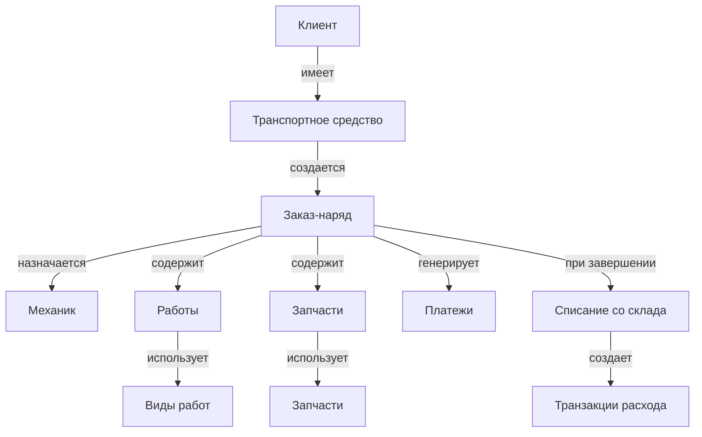
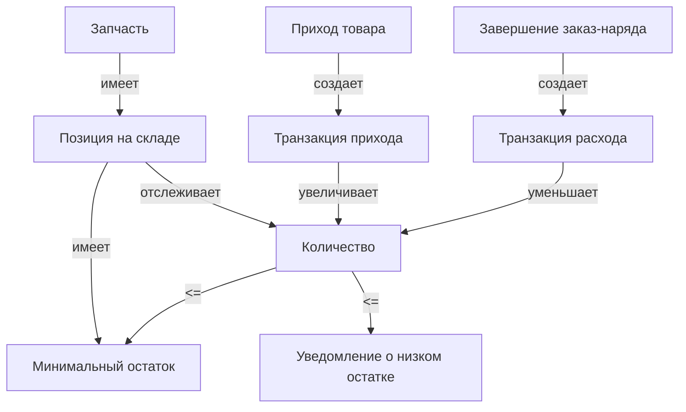
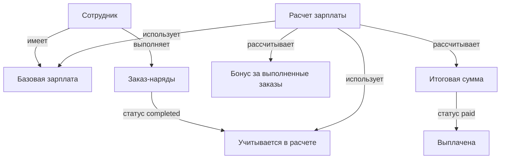
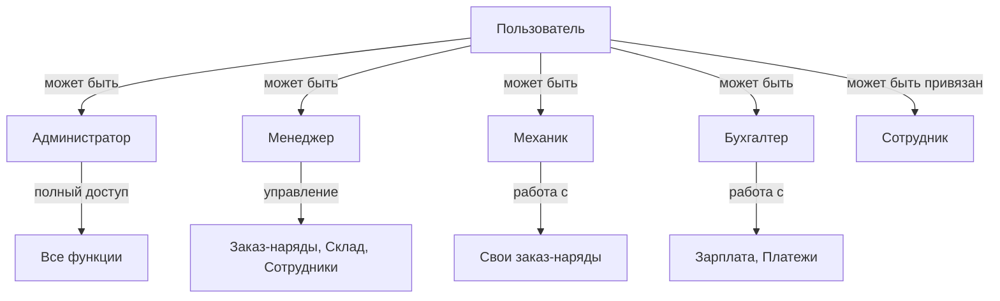
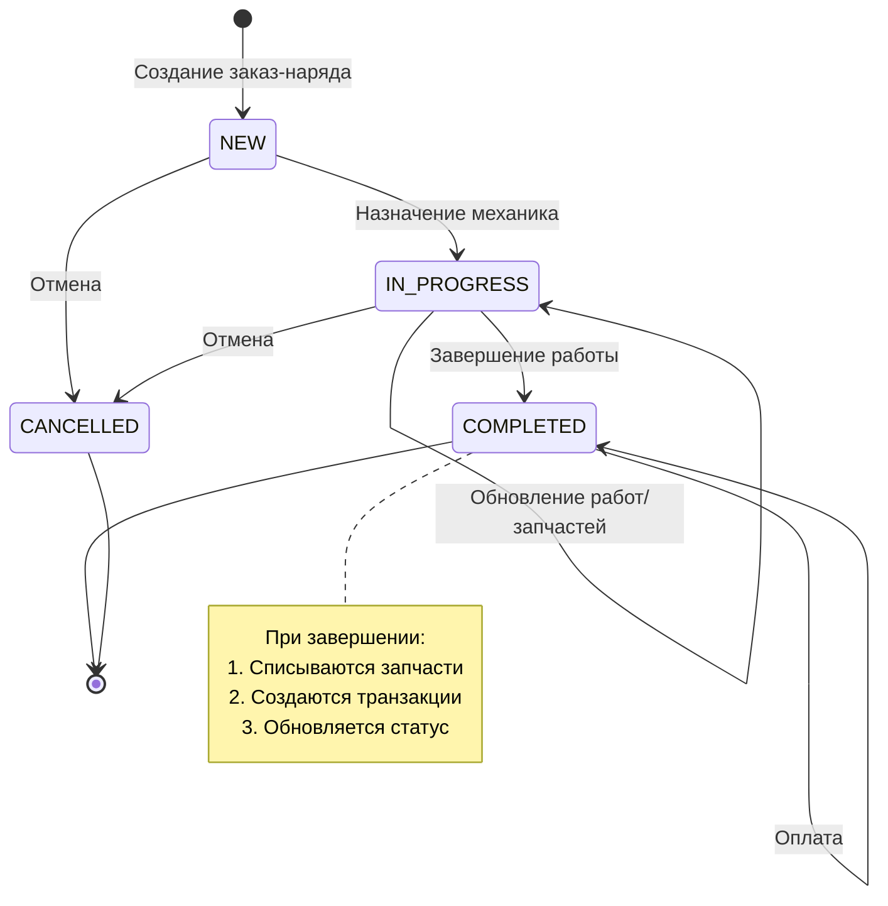
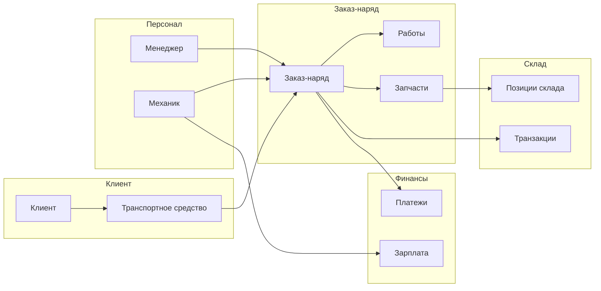

# Связи между сущностями - Система управления автосервисом

## Содержание

1. [ER-диаграмма всех сущностей](#er-диаграмма-всех-сущностей)
2. [Описание связей](#описание-связей)
3. [Enum типы](#enum-типы)
4. [Диаграммы по модулям](#диаграммы-по-модулям)

---

## ER-диаграмма всех сущностей

```mermaid
erDiagram
    User ||--o| Employee : "has"
    Employee ||--o{ Order : "creates"
    Employee ||--o{ Order : "executes"
    Employee ||--o{ Salary : "has"
    Employee ||--o{ WarehouseTransaction : "performs"
    
    Vehicle ||--o{ Order : "has"
    
    Order ||--o{ OrderWork : "contains"
    Order ||--o{ OrderPart : "contains"
    Order ||--o{ Payment : "has"
    Order ||--o{ WarehouseTransaction : "triggers"
    
    Work ||--o{ OrderWork : "used_in"
    Part ||--o{ OrderPart : "used_in"
    Part ||--|| WarehouseItem : "has"
    
    WarehouseItem ||--o{ WarehouseTransaction : "has"
    
    User {
        int id PK
        string username UK
        string email UK
        string password_hash
        enum role
        int employee_id FK
        bool is_active
        datetime created_at
        datetime updated_at
    }
    
    Employee {
        int id PK
        string full_name
        string position
        string phone
        string email
        date hire_date
        decimal salary_base
        bool is_active
        datetime created_at
        datetime updated_at
    }
    
    Vehicle {
        int id PK
        string vin UK
        string license_plate
        string brand
        string model
        int year
        string owner_name
        string owner_phone
        string owner_email
        datetime created_at
    }
    
    Order {
        int id PK
        string number UK
        int vehicle_id FK
        int employee_id FK
        int mechanic_id FK
        enum status
        decimal total_amount
        decimal paid_amount
        datetime created_at
        datetime completed_at
    }
    
    OrderWork {
        int id PK
        int order_id FK
        int work_id FK
        int quantity
        decimal price
        decimal total
    }
    
    OrderPart {
        int id PK
        int order_id FK
        int part_id FK
        int quantity
        decimal price
        decimal total
    }
    
    Work {
        int id PK
        string name
        string description
        decimal price
        int duration_minutes
        enum category
    }
    
    Part {
        int id PK
        string name
        string part_number
        string brand
        decimal price
        string unit
        enum category
    }
    
    WarehouseItem {
        int id PK
        int part_id FK UK
        decimal quantity
        decimal min_quantity
        string location
        datetime last_updated
    }
    
    WarehouseTransaction {
        int id PK
        int warehouse_item_id FK
        enum transaction_type
        decimal quantity
        decimal price
        int order_id FK
        int employee_id FK
        datetime created_at
    }
    
    Salary {
        int id PK
        int employee_id FK
        date period_start
        date period_end
        decimal base_salary
        decimal bonus
        decimal penalty
        decimal total
        enum status
        datetime created_at
        datetime paid_at
    }
    
    Payment {
        int id PK
        int order_id FK
        decimal amount
        enum payment_method
        string yookassa_payment_id UK
        enum status
        datetime created_at
    }
```

---

## Описание связей

### 1. Пользователи и сотрудники

**User ↔ Employee** (One-to-One, опциональная)
- Связь: `User.employee_id` → `Employee.id`
- Описание: Пользователь может быть привязан к сотруднику (для механиков, менеджеров и т.д.)
- Особенности:
  - Один пользователь может быть привязан только к одному сотруднику
  - Один сотрудник может иметь только одного пользователя
  - Связь опциональная (администратор может не иметь привязки к сотруднику)

### 2. Сотрудники и заказ-наряды

**Employee ↔ Order** (One-to-Many, две связи)
- Связь 1: `Order.employee_id` → `Employee.id` (кто принял заказ)
- Связь 2: `Order.mechanic_id` → `Employee.id` (кто выполняет работу)
- Описание:
  - Сотрудник (менеджер) может создать множество заказ-нарядов
  - Сотрудник (механик) может выполнять множество заказ-нарядов
- Особенности:
  - `mechanic_id` может быть NULL (заказ еще не назначен механику)
  - Один сотрудник может быть и создателем, и исполнителем заказ-наряда

### 3. Транспортные средства и заказ-наряды

**Vehicle ↔ Order** (One-to-Many)
- Связь: `Order.vehicle_id` → `Vehicle.id`
- Описание: Одно транспортное средство может иметь множество заказ-нарядов
- Особенности:
  - Связь обязательная (каждый заказ-наряд должен быть привязан к транспортному средству)

### 4. Заказ-наряды и работы

**Order ↔ OrderWork ↔ Work** (Many-to-Many через промежуточную таблицу)
- Связь: `OrderWork.order_id` → `Order.id`, `OrderWork.work_id` → `Work.id`
- Описание: Заказ-наряд может содержать множество работ, работа может использоваться в множестве заказ-нарядов
- Особенности:
  - Промежуточная таблица `OrderWork` хранит количество, цену и итоговую сумму
  - При удалении заказ-наряда удаляются все связанные работы (cascade delete)

### 5. Заказ-наряды и запчасти

**Order ↔ OrderPart ↔ Part** (Many-to-Many через промежуточную таблицу)
- Связь: `OrderPart.order_id` → `Order.id`, `OrderPart.part_id` → `Part.id`
- Описание: Заказ-наряд может содержать множество запчастей, запчасть может использоваться в множестве заказ-нарядов
- Особенности:
  - Промежуточная таблица `OrderPart` хранит количество, цену и итоговую сумму
  - При удалении заказ-наряда удаляются все связанные запчасти (cascade delete)

### 6. Запчасти и склад

**Part ↔ WarehouseItem** (One-to-One)
- Связь: `WarehouseItem.part_id` → `Part.id` (уникальная)
- Описание: Каждая запчасть может иметь только одну позицию на складе
- Особенности:
  - Связь уникальная (одна запчасть = одна позиция на складе)
  - Позиция на складе может не существовать (запчасть еще не поступила)

### 7. Склад и транзакции

**WarehouseItem ↔ WarehouseTransaction** (One-to-Many)
- Связь: `WarehouseTransaction.warehouse_item_id` → `WarehouseItem.id`
- Описание: Позиция на складе может иметь множество транзакций (приход/расход)
- Особенности:
  - Транзакции могут быть связаны с заказ-нарядом (`order_id`)
  - Транзакции связаны с сотрудником, который их выполнил

### 8. Заказ-наряды и платежи

**Order ↔ Payment** (One-to-Many)
- Связь: `Payment.order_id` → `Order.id`
- Описание: Один заказ-наряд может иметь множество платежей (частичная оплата)
- Особенности:
  - Платежи могут быть через разные методы (наличные, карта, ЮKassa)
  - Сумма `paid_amount` в заказ-наряде обновляется при успешных платежах

### 9. Сотрудники и зарплата

**Employee ↔ Salary** (One-to-Many)
- Связь: `Salary.employee_id` → `Employee.id`
- Описание: Сотрудник может иметь множество расчетов зарплаты за разные периоды
- Особенности:
  - Каждый расчет зарплаты привязан к периоду (start/end date)
  - Нельзя создать два расчета за один период для одного сотрудника

### 10. Заказ-наряды и складские транзакции

**Order ↔ WarehouseTransaction** (One-to-Many, опциональная)
- Связь: `WarehouseTransaction.order_id` → `Order.id`
- Описание: Заказ-наряд может генерировать транзакции расхода со склада
- Особенности:
  - Связь опциональная (транзакции прихода могут быть без заказа)
  - При завершении заказ-наряда создаются транзакции расхода для всех запчастей

---

## Enum типы

### UserRole
```python
ADMIN = "admin"        # Администратор
MANAGER = "manager"    # Менеджер
MECHANIC = "mechanic"  # Механик
ACCOUNTANT = "accountant"  # Бухгалтер
```

### OrderStatus
```python
NEW = "new"                    # Новый заказ-наряд
IN_PROGRESS = "in_progress"    # В работе
COMPLETED = "completed"        # Завершен
CANCELLED = "cancelled"        # Отменен
```

### WorkCategory
```python
DIAGNOSTICS = "diagnostics"    # Диагностика
REPAIR = "repair"              # Ремонт
MAINTENANCE = "maintenance"    # Обслуживание
BODY_WORK = "body_work"        # Кузовные работы
PAINTING = "painting"          # Покраска
OTHER = "other"                # Прочее
```

### PartCategory
```python
ENGINE = "engine"              # Двигатель
TRANSMISSION = "transmission"  # Трансмиссия
SUSPENSION = "suspension"      # Подвеска
BRAKES = "brakes"              # Тормоза
ELECTRICAL = "electrical"     # Электрика
BODY = "body"                  # Кузов
CONSUMABLES = "consumables"    # Расходники
OTHER = "other"                # Прочее
```

### TransactionType
```python
INCOMING = "incoming"      # Приход
OUTGOING = "outgoing"      # Расход
ADJUSTMENT = "adjustment"  # Корректировка
```

### SalaryStatus
```python
DRAFT = "draft"            # Черновик
CALCULATED = "calculated"  # Рассчитана
PAID = "paid"              # Выплачена
```

### PaymentMethod
```python
CASH = "cash"           # Наличные
CARD = "card"           # Карта
YOOKASSA = "yookassa"   # ЮKassa (онлайн)
```

### PaymentStatus
```python
PENDING = "pending"     # Ожидает оплаты
SUCCEEDED = "succeeded" # Успешно оплачен
CANCELLED = "cancelled" # Отменен
REFUNDED = "refunded"   # Возвращен
```

---

## Диаграммы по модулям

### Модуль: Клиент и заказ-наряд



### Модуль: Склад



### Модуль: Зарплата



### Модуль: Пользователи и права доступа



### Полный жизненный цикл заказ-наряда



### Связи между основными сущностями (упрощенная схема)



---

## Ключевые особенности связей

### Каскадные операции
- При удалении заказ-наряда автоматически удаляются связанные `OrderWork` и `OrderPart` (cascade delete)
- При удалении пользователя связь с сотрудником разрывается (employee_id становится NULL)

### Ограничения целостности
- `Vehicle.vin` - уникальный (если указан)
- `User.username` и `User.email` - уникальные
- `Order.number` - уникальный
- `WarehouseItem.part_id` - уникальный (одна запчасть = одна позиция на складе)
- `Payment.yookassa_payment_id` - уникальный (если указан)

### Индексы для производительности
- `User.username`, `User.email` - индексированы
- `Vehicle.vin`, `Vehicle.license_plate` - индексированы
- `Order.number` - индексирован
- Все внешние ключи автоматически индексируются

### Бизнес-правила
1. **Заказ-наряд**: При завершении проверяется наличие запчастей на складе
2. **Зарплата**: Нельзя создать два расчета за один период для одного сотрудника
3. **Склад**: При расходе проверяется достаточность количества
4. **Пользователь**: Механик видит только свои заказ-наряды


